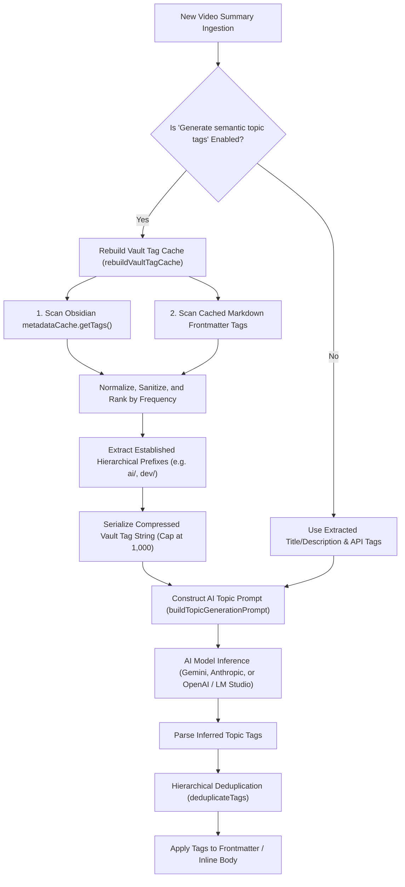

# AI Semantic Topic Tagging & Vault Tag Taxonomy

This document provides a comprehensive technical and functional guide to the **AI Semantic Topic Tagging** feature in the YouTube Video Summarizer plugin for Obsidian.

---

## 1. Overview & Core Purpose

Obsidian vaults thrive on consistent, cohesive tagging taxonomies. When ingesting YouTube videos, relying solely on creator video tags or title hashtags can produce fragmented, redundant, or inconsistent tags across your notes.

The **AI Semantic Topic Tagging** feature (`addTopicsAsTags`) utilizes your configured AI model to analyze the full summary and metadata of incoming YouTube videos. It semantically categorizes videos into appropriate subjects and identifies missing tags, while actively consulting your vault's existing tag taxonomy to maximize tag reuse and prevent tag proliferation.

---

## 2. Key Architectural Tenets

1. **Opt-in & Zero-Overhead when Disabled**:
   - Controlled by the toggle **"Generate semantic topic tags"** (`addTopicsAsTags` in settings).
   - When disabled, no vault tag indexing, caching, or extra LLM calls take place.
2. **Context-Aware Inference**:
   - Rather than generating tags in isolation, the AI model is supplied with:
     - Tags already extracted from the video (title hashtags, description hashtags, YouTube Data API keywords).
     - A compressed cache of all existing tags across your Obsidian vault.
     - Detected established hierarchical group prefixes (e.g., `ai/`, `dev/`, `finance/`).
3. **Preference for Tag Reuse**:
   - The AI is strictly instructed to reuse existing tags from the vault whenever semantically appropriate, only creating new tags if no suitable tag exists.
4. **Hierarchical Grouping**:
   - If established group prefixes exist in your vault (e.g., `ai/`), the model is instructed to nest specific concepts under that prefix (e.g. `ai/machine-learning` rather than creating a flat `ai-machine-learning` tag).

---

## 3. Workflow & Architecture Diagram

---

## 4. The AI Tagging Prompt

The inference prompt is centralized in [`src/utils/vaultTags.ts`](file:///c:/Users/corey/dev/github.com/coreyx/obsidian-yt-video-summarizer/src/utils/vaultTags.ts) via `buildTopicGenerationPrompt()` and shared across all AI providers.

### Core Questions Posed to the Model

In every inference call, the model is explicitly asked two analytical questions:
1. **What topic(s) does this video belong to?**
2. **Is there any obvious tag that is missing in the existing set of tags?**

### Prompt Guidelines & Rules

The prompt enforces four strict behavioral rules:

1. **Always Prefer to Reuse Existing Tags**:
   - The model must check the cached vault tag list before creating any new tag. If a tag with matching semantic intent already exists in the user's vault, the model must reuse it verbatim.
2. **Kebab-Case Formatting**:
   - Any newly created tags must strictly follow lowercase kebab-case (e.g. `system-design`, `prompt-engineering`).
3. **Group Tags Under Established Prefixes**:
   - If the vault has an established group prefix like `ai/` or `dev/`, the model must group the more specific concept under that prefix instead of creating an independent top-level tag.
   - *Example*: Use `ai/machine-learning` instead of `ai-machine-learning`.
   - *Example*: Use `dev/frontend` instead of `dev-frontend`.
4. **Clean, Machine-Readable Output**:
   - Returns ONLY a comma-separated list of 3 to 7 lowercase tags, without hashtags (`#`), markdown bullet points, or conversational pleasantries.

---

## 5. Whole-Vault Compressed Tag Cache Pipeline

The cache pipeline is implemented in [`src/utils/vaultTags.ts`](file:///c:/Users/corey/dev/github.com/coreyx/obsidian-yt-video-summarizer/src/utils/vaultTags.ts) and orchestrated by [`YouTubeSummarizerPlugin.rebuildVaultTagCache()`](file:///c:/Users/corey/dev/github.com/coreyx/obsidian-yt-video-summarizer/src/main.ts).

### 1. Dual-Tier Tag Harvesting
- **Tier 1 (Fast Dictionary Lookup)**: Reads Obsidian's `app.metadataCache.getTags()`. This retrieves an in-memory dictionary of all known vault tags and their occurrence counts with $O(1)$ efficiency.
- **Tier 2 (File Cache Supplementation)**: Iterates cached file metadata (`app.metadataCache.getFileCache()`) across all vault markdown files to capture newly added frontmatter tags that might not yet be aggregated in `getTags()`.

### 2. Normalization & Sanitization
- Strips `#` symbols and illegal characters.
- Converts to lowercase.
- Replaces spaces and underscores with hyphens (`-`).
- Preserves forward slashes (`/`) for hierarchical tags.
- Filters out empty tokens, single characters, and pure numeric tags (e.g. `#123`).

### 3. Frequency Ranking & Token Compression
- Tags are counted and sorted by **frequency descending**, then alphabetically.
- **Token Cap**: To ensure local models (e.g. LM Studio, Ollama) and cloud providers do not exhaust context limits, the cache is bounded to the top 1,000 most frequent tags.
- **Serialization**: Tags are formatted into a token-efficient comma-separated string rather than verbose markdown lists, minimizing input token consumption.

### 4. Established Group Prefix Detection
- [`extractGroupPrefixes()`](file:///c:/Users/corey/dev/github.com/coreyx/obsidian-yt-video-summarizer/src/utils/vaultTags.ts) detects any prefix containing a forward slash `/` (e.g. `ai/`, `dev/`, `finance/`).
- If sub-groupings exist (e.g. `dev/frontend/react`), both root (`dev/`) and intermediate (`dev/frontend/`) prefixes are extracted and provided to the model.

---

## 6. Multi-Source Tag Merging & Hierarchical Deduplication

When a video note is summarized, tags originate from multiple sources:
1. **Title & Description Hashtags**: Extracted via regex from creator text.
2. **YouTube Data API Keywords**: Complete keyword taxonomy assigned by the creator.
3. **AI Semantic Topic Tags**: Inferred topics and filled gaps from the LLM.

All candidate tags are unified through [`deduplicateTags()`](file:///c:/Users/corey/dev/github.com/coreyx/obsidian-yt-video-summarizer/src/utils/frontmatter.ts):

### Hierarchical Group Preference Logic
When two tag candidates normalize to the same alphanumeric key (e.g. `ai/machine-learning` vs `ai-machine-learning`):
- **Hierarchical tags with `/` always take precedence** over flat hyphenated tags.
- If both or neither contain slashes, the version with the highest delimiter specificity (e.g. `machine-learning` vs `machinelearning`) is retained.

---

## 7. Supported AI Providers

AI topic tagging operates seamlessly across all supported providers:

| Provider | Implementation File | Token Configuration | Model Compatibility |
| :--- | :--- | :--- | :--- |
| **Google Gemini** | [`src/services/providers/gemini.ts`](file:///c:/Users/corey/dev/github.com/coreyx/obsidian-yt-video-summarizer/src/services/providers/gemini.ts) | `maxOutputTokens: 200`, `temperature: 0.2` | Gemini 3.8 Flash, Gemini 3.5 Flash, Gemini 3.1 Pro |
| **Anthropic** | [`src/services/providers/anthropic.ts`](file:///c:/Users/corey/dev/github.com/coreyx/obsidian-yt-video-summarizer/src/services/providers/anthropic.ts) | `max_tokens: 200`, `temperature: 0.2` | Claude 3.7 Sonnet, Claude 3.5 Sonnet, Claude 3.5 Haiku |
| **OpenAI** | [`src/services/providers/openai.ts`](file:///c:/Users/corey/dev/github.com/coreyx/obsidian-yt-video-summarizer/src/services/providers/openai.ts) | `max_completion_tokens: 200`, `temperature: 0.2` | GPT-4o, GPT-4o-mini, o3-mini (reasoning safe) |
| **LM Studio / Local** | [`src/services/providers/openai.ts`](file:///c:/Users/corey/dev/github.com/coreyx/obsidian-yt-video-summarizer/src/services/providers/openai.ts) | Uses OpenAI-compatible endpoint | Qwen 2.5, Llama 3.2, Mistral, Gemma 2 |

---

## 8. Token Usage & Context Window Transparency

> [!NOTE]
> **Context Window Impact**:
> Because the AI topic tagging feature injects your vault's existing tag taxonomy into the LLM context, prompt size increases in proportion to the number of unique tags in your vault.
> - A vault with 100 tags adds approximately 200–300 tokens to the inference prompt.
> - A vault with 500 tags adds approximately 1,000–1,200 tokens.
> - The cache hard-caps at 1,000 tags (~2,000 tokens) to guarantee safety for local models with smaller context windows.
>
> If you are operating on strict token budgets or pay-per-token models with tight limits, you can toggle **"Generate semantic topic tags"** off at any time.

---

## 9. Verification & Unit Tests

The functionality is tested in [`tests/test-features.mjs`](file:///c:/Users/corey/dev/github.com/coreyx/obsidian-yt-video-summarizer/tests/test-features.mjs):
- **Test 28.1**: Group prefix extraction across nested hierarchies.
- **Test 28.2**: Tag frequency sorting and sanitization.
- **Test 28.3**: Prompt generation verifying question inclusion, prefix exposure, and rule enforcement.
- **Test 28.4**: Hierarchical deduplication prioritizing grouped tags (`/`) over flat tags (`-`).
- **Test 28.5**: Conditional activation verifying zero execution when the setting is disabled.
